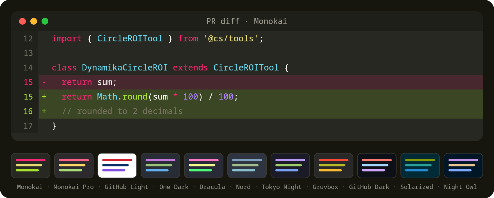

# Bitbucket Diff Themes

A small Chrome extension (Manifest V3) that brings editor-style **dark (and light)
themes** to Bitbucket Cloud pull-request diffs. It recolors the existing syntax
tokens and diff lines via CSS — pick a palette, tweak typography, toggle on/off
from the popup. Changes apply live, no page reload.



## Why CSS-only

Bitbucket renders diffs with React. An earlier version generated its own syntax
tokens by rewriting each line's `innerHTML`, which corrupted React's reconciler and
crashed the page (`NotFoundError: Failed to execute 'removeChild'`). The diff already
carries token spans, so this extension performs **zero per-node DOM mutation**: it
only injects a `<style>` with the chosen palette's CSS variables and toggles a
`[data-bdt-on]` attribute on `<html>`. A static stylesheet recolors the existing
tokens, line backgrounds, and gutter — gated on that attribute so disabling reverts
cleanly. CSS is declarative, so virtualized/lazily-mounted rows are themed
automatically without a MutationObserver.

> **Note:** because it restyles tokens rather than generating them, it depends on
> Bitbucket's diff already containing token spans. If they are ever absent, the
> extension still themes diff-line backgrounds and typography, just without syntax
> colors.

## Install (load unpacked)

1. Open `chrome://extensions` and enable **Developer mode**.
2. Click **Load unpacked** and select this folder.
3. Open a Bitbucket pull request → **Diff** tab. The default **Monokai** theme
   applies. Reload the tab (F5) if you loaded the extension while the page was open.

## Usage

Click the extension icon (pin it via the 🧩 menu if hidden) to open the popup:

- **Enabled** — turn theming on/off
- **Theme** — pick one of the palettes below
- **Font size** / **Line height** — diff typography
- **Mono font** — JetBrains Mono, Fira Code, SF Mono, Menlo, Consolas, or system default

Settings are stored in `chrome.storage.sync` and apply live to all open
`bitbucket.org` tabs.

## Themes

Monokai (default), Monokai Pro, GitHub Light, One Dark, Dracula, Nord, Tokyo Night,
Gruvbox Dark, GitHub Dark, Solarized Dark, Night Owl.

Each theme is a flat map of color roles in [`src/themes.js`](src/themes.js)
(`bg`, `fg`, `keyword`, `string`, `function`, `class`, `number`, `comment`,
`punctuation`, plus diff-line and hunk colors). Add a theme by appending one entry
there — no other change needed.

## How it's wired

| File | Responsibility |
|------|----------------|
| `manifest.json` | MV3 config; matches `bitbucket.org`; loads scripts in order |
| `src/themes.js` | The palettes (single source of truth) |
| `src/theme-css.js` | Builds the `:root { --bdt-* }` variable block from a palette |
| `src/defaults.js` | Default settings + merge helper |
| `src/selectors.css` | Maps Bitbucket diff selectors → `--bdt-*`, gated on `[data-bdt-on]` |
| `src/content.js` | Injects the variable block, toggles `[data-bdt-on]`, reacts to settings |
| `popup/` | The settings UI |

## Development

```bash
npm test        # unit tests for palettes, the CSS-var builder, and settings (node --test)
```

No build step — the extension is plain JS/CSS/HTML, loaded unpacked.

## License

MIT
